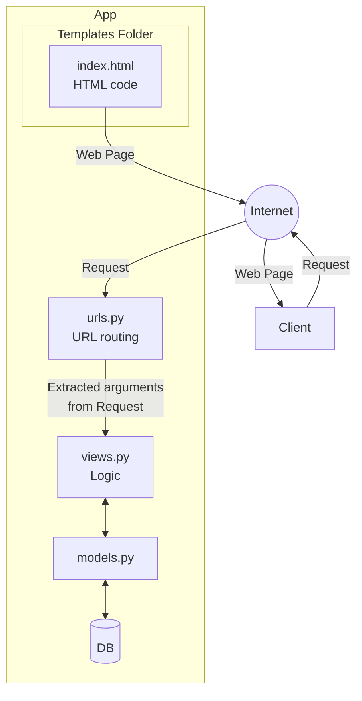

### Jelaskan bagaimana cara kamu mengimplementasikan checklist di atas secara step-by-step (bukan hanya sekadar mengikuti tutorial).
1. Membuat repository dengan nama ```eshop-pbp```
2. Membuat ```README.md``` dan clone di folder pbp di local folder
3. Melakukan ```python -m venv env``` untuk set up environment
4. Membuat dan ```pip install -r requirements.txt```
5. Membuat folder ```eshop_pbp``` sebagai direktori project dengan melakukan ```django-admin startproject eshop_pbp .```
6. Membuat foler ```main``` dengan melakukan ```python manage.py startapp main```
7. Menambahkan ```"main"``` pada ```INSTALLED_APPS``` yang ada pada ```settings.py```
8. Menambah ```ALLOWED_HOSTS``` untuk keperluan deployment
9. Menambah ```.gitignore``` pada direktori utama
10. Melakukan add, commit, push ke repo
11. Melakukan deployment pada PWS sekaligus menambah URL deployment pada ```ALLOWED_HOSTS``` yang terdapat pada ```settings.py```
12. Rename branch menjadi ```main```
13. ```Add```, ```commit```, ```push``` ke PWS
14. Membuat ```models```, kemudian ```makemigrations``` dan ```migrate```
15. Membuat fungsi (pada `views.py`) yang me-_render_ HTML yang ada pada `main.html` pada direktori `templates`
16. Menambah ```include(main.urls)``` pada ```urls.py``` yang berada pada direktori utama
17. Menambah ```path('', show_main, name='main')``` pada ```urls.py``` pada direktori projek
18. ```Add```, ```commit```, ```push``` ke branch ```main``` dan ```pws main:master```

Banyak kombinasi langkah yang bisa dilakukan untuk menyelesaikan semua _checklist_ pada berkas soal, namun _"All roads lead to Rome"_, salah satunya yang saya lakukan di atas.

### Buatlah bagan yang berisi request client ke web aplikasi berbasis Django beserta responnya dan jelaskan pada bagan tersebut kaitan antara urls.py, views.py, models.py, dan berkas html.


### Jelaskan fungsi git dalam pengembangan perangkat lunak!
Git adalah sistem kontrol versi terdistribusi yang memainkan peran krusial dalam pengembangan perangkat lunak modern. Fungsi utamanya mencakup pelacakan perubahan kode (version control), memfasilitasi kolaborasi tim melalui fitur branching dan merging, menyediakan backup terdistribusi, mendukung pengembangan paralel, dan memungkinkan pengembalian ke versi sebelumnya jika diperlukan. Git juga mendukung alur kerja CI/CD, memudahkan kontribusi open source, dan meningkatkan efisiensi pengembangan dengan operasi lokalnya yang cepat. Dengan kemampuan untuk melakukan commit, push, pull, dan clone, Git memungkinkan pengembang untuk bekerja secara fleksibel, baik secara individu maupun dalam tim, sambil menjaga integritas dan riwayat proyek.

### Menurut Anda, dari semua framework yang ada, mengapa framework Django dijadikan permulaan pembelajaran pengembangan perangkat lunak?
Django adalah salah satu framework Python, yang sering digunakan untuk _backend development_ yang merupakan _high-level programming language_ yang membuat framework tersebut mudah dipelajari karena _syntax_-nya _self-explanatory_ sehingga penggunaannya mudah dan memiliki tingkat _readibility_ yang tinggi yang membuat kodenya mudah dipahami oleh developer lain ketika melakukan kolaborasi. Selain itu, dibandingkan dengan Flask, yang merupakan _framework_ Python yang sering digunakan _backend dev_ juga. Hal yang membuat Django lebih ramah pemula dibanding Flask adalah karena banyak _builtin function_ yang telah disediakan, sedangkan Flask cenderung "build from scratch". Django juga 

### Mengapa model pada Django disebut sebagai ORM?
Model pada Django disebut sebagai ORM (Object Relational Mapping) karena berfungsi sebagai penghubung antara pemrograman berorientasi objek dan sistem basis data relasional. ORM memungkinkan pengembang berinteraksi dengan basis data menggunakan kode Python, tanpa perlu menulis query SQL langsung. Setiap kelas model mewakili tabel dalam basis data, dengan atribut-atribut kelas memetakan ke kolom-kolom tabel. Django ORM menyediakan abstraksi basis data, pemetaan objek-tabel, enkapsulasi logika bisnis, independensi basis data, API query yang kuat, migrasi otomatis, validasi data, manajemen relasi antar-model, lazy loading, dan mekanisme caching. Pendekatan ini menjembatani kesenjangan antara paradigma OOP dan model data relasional, memungkinkan pengembang bekerja dengan data secara lebih intuitif dan efisien.
