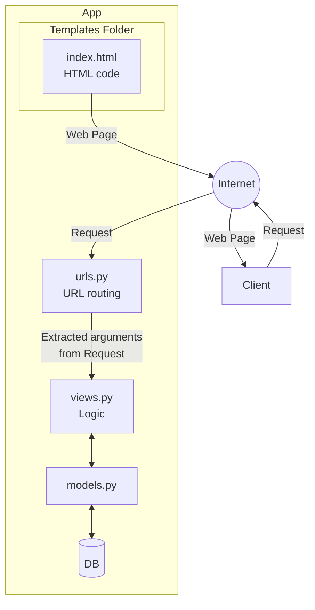

# TUGAS 2

### Jelaskan bagaimana cara kamu mengimplementasikan checklist di atas secara step-by-step (bukan hanya sekadar mengikuti tutorial).
1. Membuat repository dengan nama ```eshop-pbp```
2. Membuat ```README.md``` dan clone di folder pbp di local folder
3. Melakukan ```python -m venv env``` untuk set up environment
4. Membuat dan ```pip install -r requirements.txt```
5. Membuat folder ```eshop_pbp``` sebagai direktori project dengan melakukan ```django-admin startproject eshop_pbp .```
6. Membuat foler ```main``` dengan melakukan ```python manage.py startapp main```
7. Menambahkan ```"main"``` pada ```INSTALLED_APPS``` yang ada pada ```settings.py```
8. Menambah ```ALLOWED_HOSTS``` untuk keperluan deployment
9. Menambah ```.gitignore``` pada direktori utama
10. Melakukan add, commit, push ke repo
11. Melakukan deployment pada PWS sekaligus menambah URL deployment pada ```ALLOWED_HOSTS``` yang terdapat pada ```settings.py```
12. Rename branch menjadi ```main```
13. ```Add```, ```commit```, ```push``` ke PWS
14. Membuat ```models```, kemudian ```makemigrations``` dan ```migrate```
15. Membuat fungsi (pada `views.py`) yang me-_render_ HTML yang ada pada `main.html` pada direktori `templates`
16. Menambah ```include(main.urls)``` pada ```urls.py``` yang berada pada direktori utama
17. Menambah ```path('', show_main, name='main')``` pada ```urls.py``` pada direktori projek
18. ```Add```, ```commit```, ```push``` ke branch ```main``` dan ```pws main:master```

Banyak kombinasi langkah yang bisa dilakukan untuk menyelesaikan semua _checklist_ pada berkas soal, namun _"All roads lead to Rome"_, salah satunya yang saya lakukan di atas.

### Buatlah bagan yang berisi request client ke web aplikasi berbasis Django beserta responnya dan jelaskan pada bagan tersebut kaitan antara urls.py, views.py, models.py, dan berkas html.


### Jelaskan fungsi git dalam pengembangan perangkat lunak!
Git adalah sistem kontrol versi terdistribusi yang memainkan peran krusial dalam pengembangan perangkat lunak modern. Fungsi utamanya mencakup pelacakan perubahan kode (version control), memfasilitasi kolaborasi tim melalui fitur branching dan merging, menyediakan backup terdistribusi, mendukung pengembangan paralel, dan memungkinkan pengembalian ke versi sebelumnya jika diperlukan. Git juga mendukung alur kerja CI/CD, memudahkan kontribusi open source, dan meningkatkan efisiensi pengembangan dengan operasi lokalnya yang cepat. Dengan kemampuan untuk melakukan commit, push, pull, dan clone, Git memungkinkan pengembang untuk bekerja secara fleksibel, baik secara individu maupun dalam tim, sambil menjaga integritas dan riwayat proyek.

### Menurut Anda, dari semua framework yang ada, mengapa framework Django dijadikan permulaan pembelajaran pengembangan perangkat lunak?
Django adalah salah satu framework Python, yang sering digunakan untuk _backend development_ yang merupakan _high-level programming language_ yang membuat framework tersebut mudah dipelajari karena _syntax_-nya _self-explanatory_ sehingga penggunaannya mudah dan memiliki tingkat _readibility_ yang tinggi yang membuat kodenya mudah dipahami oleh developer lain ketika melakukan kolaborasi. Selain itu, dibandingkan dengan Flask, yang merupakan _framework_ Python yang sering digunakan _backend dev_ juga. Hal yang membuat Django lebih ramah pemula dibanding Flask adalah karena banyak _builtin function_ yang telah disediakan, sedangkan Flask cenderung "build from scratch".

### Mengapa model pada Django disebut sebagai ORM?
Model pada Django disebut sebagai ORM (Object Relational Mapping) karena berfungsi sebagai penghubung antara pemrograman berorientasi objek dan sistem basis data relasional. ORM memungkinkan pengembang berinteraksi dengan basis data menggunakan kode Python, tanpa perlu menulis query SQL langsung. Setiap kelas model mewakili tabel dalam basis data, dengan atribut-atribut kelas memetakan ke kolom-kolom tabel. Django ORM menyediakan abstraksi basis data, pemetaan objek-tabel, enkapsulasi logika bisnis, independensi basis data, API query yang kuat, migrasi otomatis, validasi data, manajemen relasi antar-model, lazy loading, dan mekanisme caching. Pendekatan ini menjembatani kesenjangan antara paradigma OOP dan model data relasional, memungkinkan pengembang bekerja dengan data secara lebih intuitif dan efisien.


# TUGAS 3

### Jelaskan mengapa kita memerlukan data delivery dalam pengimplementasian sebuah platform?
_Data delivery_ merupakan aspek krusial dalam pengimplementasian sebuah platform karena memungkinkan pertukaran informasi yang efisien antar berbagai komponen sistem. Dalam arsitektur aplikasi modern, seringkali terdapat kebutuhan untuk mengirimkan data dari satu stack ke stack lainnya, misalnya antara frontend dan backend. Data delivery memfasilitasi komunikasi ini, memungkinkan aplikasi untuk berinteraksi dengan database atau layanan eksternal secara seamless. Selain itu, penggunaan format data terstruktur seperti XML atau JSON dalam proses delivery memudahkan representasi dan pemrosesan informasi, mendukung interoperabilitas antar sistem yang mungkin dibangun dengan teknologi berbeda. Dengan demikian, data delivery menjadi pondasi penting dalam membangun platform yang responsif, skalabel, dan mampu mengintegrasikan berbagai layanan dengan efektif.

### Menurutmu, mana yang lebih baik antara XML dan JSON? Mengapa JSON lebih populer dibandingkan XML?
Dalam konteks modern web development, JSON umumnya dianggap lebih baik dan telah menjadi lebih populer dibandingkan XML. Keunggulan utama JSON terletak pada kesederhanaannya; format ini lebih ringkas dan mudah dibaca baik oleh manusia maupun mesin. Struktur data JSON yang lebih straightforward membuatnya lebih cepat untuk di-parse dan lebih efisien dalam penggunaan memori. Sebagai format native JavaScript, JSON sangat cocok untuk aplikasi web, terutama yang banyak menggunakan AJAX.
JSON juga mendukung tipe data yang umum digunakan seperti string, number, boolean, array, dan object, menjadikannya sangat fleksibel untuk berbagai kebutuhan. Ukuran file JSON yang umumnya lebih kecil dibandingkan XML juga menghasilkan penghematan bandwidth, aspek penting dalam pengembangan aplikasi mobile dan web yang responsif. Meski demikian, XML masih memiliki tempat dalam skenario tertentu, terutama ketika diperlukan validasi skema yang lebih ketat atau markup yang lebih kompleks. Namun, untuk mayoritas aplikasi modern, terutama dalam ekosistem web dan mobile, JSON telah menjadi pilihan utama karena kemudahan penggunaan dan efisiensinya.

### Jelaskan fungsi dari method is_valid() pada form Django dan mengapa kita membutuhkan method tersebut?
Method is_valid() pada form Django memainkan peran vital dalam proses validasi data input. Fungsi ini secara komprehensif memeriksa semua field dalam form untuk memastikan bahwa data yang dimasukkan memenuhi kriteria yang telah ditetapkan. Ini mencakup pemeriksaan apakah semua field yang wajib diisi (required) telah terisi, serta menjalankan berbagai aturan validasi yang mungkin telah didefinisikan secara custom untuk form tersebut.
Penggunaan is_valid() sangat penting karena membantu menjaga integritas dan konsistensi data sebelum disimpan ke database. Dengan memvalidasi input pengguna, kita dapat mencegah penyimpanan data yang tidak valid atau potensial berbahaya, sehingga meningkatkan keamanan aplikasi secara keseluruhan. Method ini juga memungkinkan kita untuk memberikan feedback yang akurat kepada pengguna jika terdapat kesalahan dalam input mereka, meningkatkan user experience. Dalam konteks pengembangan web yang aman dan robust, is_valid() menjadi garis pertahanan pertama dalam memastikan bahwa hanya data yang memenuhi standar yang diproses lebih lanjut oleh aplikasi.

### Mengapa kita membutuhkan csrf_token saat membuat form di Django? Apa yang dapat terjadi jika kita tidak menambahkan csrf_token pada form Django? Bagaimana hal tersebut dapat dimanfaatkan oleh penyerang?
CSRF token merupakan mekanisme keamanan kritis dalam pengembangan aplikasi web Django. Penggunaan csrf_token saat membuat form berfungsi sebagai pertahanan utama terhadap serangan Cross-Site Request Forgery (CSRF). Token ini memastikan bahwa setiap request POST yang diterima oleh server benar-benar berasal dari situs yang legitimate, bukan dari sumber yang tidak sah.
Tanpa csrf_token, aplikasi menjadi sangat rentan terhadap serangan CSRF. Dalam skenario seperti ini, penyerang dapat dengan mudah membuat halaman web berbahaya yang secara otomatis mengirimkan form ke aplikasi target. Jika seorang pengguna yang sudah terotentikasi tidak sengaja mengakses halaman tersebut, penyerang dapat memanipulasi browser pengguna untuk melakukan aksi-aksi yang tidak diinginkan tanpa sepengetahuan pengguna.
Eksploitasi kerentanan ini bisa sangat berbahaya. Penyerang dapat melakukan berbagai operasi atas nama pengguna yang sudah login, seperti mengubah password, mentransfer dana, atau bahkan menghapus data penting. Dengan adanya CSRF token, setiap request yang tidak memiliki token valid akan secara otomatis ditolak oleh server Django. Ini secara efektif mencegah serangan CSRF, karena penyerang tidak akan dapat menggenerate token yang valid dari situs eksternal. Oleh karena itu, penggunaan csrf_token menjadi komponen penting dalam membangun lapisan keamanan yang kuat untuk aplikasi web Django.

### Jelaskan bagaimana cara kamu mengimplementasikan checklist di atas secara step-by-step (bukan hanya sekadar mengikuti tutorial).
Membuat `base.html` sebagai layout dari page yang meng-_extend_ `base.html` dengan konten sebagai berikut

```

<!DOCTYPE html>
<html lang="en">
  <head>
    <meta charset="UTF-8" />
    <meta name="viewport" content="width=device-width, initial-scale=1.0" />
     
  </head>

  <body>
     
  </body>
</html>
```

Menambah `BASE_DIR / 'templates'` pada list `DIRS` pada `settings.py` agar `base.html` bisa terdeteksi sebagai berkas _template_. Potongan kodenya sebagai berikut

```
TEMPLATES = [
    {
        'BACKEND': 'django.template.backends.django.DjangoTemplates',
        'DIRS': [BASE_DIR / 'templates'], # Tambahkan konten baris ini
        'APP_DIRS': True,
        ...
    }
]
```

Menambah `  dan ` pada awal dan akhir dari `main.html` untuk menerpakan layout dari `base.html` ke `main.html`

Menambah primary key yang berbasis uuid pada model Product pada file `models.py`

```
id = models.UUIDField(primary_key=True, default=uuid.uuid4, editable=False)
```

Melakukan `makemigrations` dan `migrate` untuk mengimplementasikan perubahan yang terjadi pada `models.py` ke database

```
python manage.py makemigrations
python manage.py migrate
```

Membuat class `ProductForm`, yang meng-_extend_ class `ModelForm` yang merupakan _builtin form class_ dari Django, yang berfungsi sebagai struktur _form_ yang dapat menerima entri Product baru

```
from django.forms import ModelForm
from main.models import Product

class ProductForm(ModelForm):
    class Meta:
        model = Product
        fields = ["name", "price", "description", "stock"]
```

Menambah fungsi `create_product` pada `views.py` yang berfungsi untuk memvalidasi input pada form dan membuat sebuah instance Product jika input valid dan me-_redirect_ ke page main setelah selesai mengisi form dan data berhasil disimpan.

```
def create_product(request):
    form = ProductForm(request.POST or None)

    if form.is_valid() and request.method == "POST":
        form.save()
        return redirect('main:show_main')
    
    context = {'form': form}
    return render(request, "create_product.html", context)
```

Menambah variabel ```products``` pada fungsi ```show_main``` pada ```views.py``` yang menampung seluruh instance dari Products yang dibuat berdasarkan input form yang berhasil dan memasukkan variabel tersebut pada ```context```

```
def show_main(request):
    products = Product.objects.all()
    context = {
        "nama_aplikasi": "Sutashop",
        "nama": "Vissuta Gunawan Lim",
        "kelas": "D",
        'products': products
    }

    return render(request, 'main.html', context)
```

Menambah path `create-product` pada `urlpatterns` yang ada di `urls.py` pada aplikasi `main` sebagai endpoint yang mengakses fungsi `create_product`

```
urlpatterns = [
   ...
   path('create-product', create_product, name='create_product'),
]
```

Membuat file HTML bernama `create_product.html` pada direktori `main/templates` yang meng-_handle_ tampilan form entri produk. Kontennya adalah sebagai berikut:

```
 


<h1>Add New Product</h1>

<form method="POST">
  
  <table>
    {{form.as_table}}
    <tr>
      <td></td>
      <td>
        <input type="submit" value="Add New Product" />
      </td>
    </tr>
  </table>
</form>


```

Menambahkan `` dan `` serta _handle logic_ jika `products` kosong (belum ada entri produk), jika entri produk ada, semua entri produk yang sudah dimasukkan dan valid akan ditampilkan

```


<!DOCTYPE html>
<html lang="en">
  <head>
    <meta charset="UTF-8" />
    <meta name="viewport" content="width=device-width, initial-scale=1.0" />
    <title>{{nama_aplikasi}}</title>
  </head>
  <body>
    
    <h1>{{nama_aplikasi}}</h1>
    <h2>by {{nama}} dari kelas {{kelas}}</h2>

    
    <p>Belum ada data product pada Sutashop</p>
    
    <table>
      <tr>
        <th>Product Name</th>
        <th>Product Price</th>
        <th>Product Description</th>
        <th>Product Stock</th>
      </tr>

       Berikut cara memperlihatkan data product di bawah baris ini
       
      <tr>
        <td>{{product.name}}</td>
        <td>{{product.price}}</td>
        <td>{{product.description}}</td>
        <td>{{product.stock}}</td>
      </tr>
      
    </table>
    
    <br />
    <a href="">
      <button>Add New Product</button>
    </a>
    
  </body>
</html>
```

Membuat fungsi `show_xml`, `show_json`, `show_xml_by_id`, dan `show_json_by_id` pada `views.py`

```
def show_xml(request):
    products = Product.objects.all()
    return HttpResponse(serializers.serialize("xml", products), content_type="application/xml")

def show_json(request):
    products = Product.objects.all()
    return HttpResponse(serializers.serialize("json", products), content_type="application/json")

def show_xml_by_id(request, pk):
    product = Product.objects.filter(id=pk)
    return HttpResponse(serializers.serialize("xml", product), content_type="application/xml")

def show_json_by_id(request,pk):
    product = Product.objects.filter(id=pk)
    return HttpResponse(serializers.serialize("json", product), content_type="application/json")
```

Melakukan `python manage.py runserver`

Membuka `http://localhost:8000` dan mengisi form dengan entri _dummy_

Melakukan `GET` request pada `http://localhost:8000` melalui Postman untuk memeriksa keberadaan entri yang sudah dimasukkan

Berikut foto hasil `GET` request pada Postman


# TUGAS 4

### Apa perbedaan antara HttpResponseRedirect() dan redirect()

Perbedaan antara HttpResponseRedirect() dan redirect() adalah fleksibilitas yang ditawarkan, HttpResponseRedirect() adalah kelas dasar yang digunakan untuk melakukan redirect, namun memerlukan URL lengkap sebagai argumen, sedangkan redirect() adalah fungsi yang lebih __high level__ dan fleksibel sehingga dapat menerima berbagai jenis argumen seperti nama __view__, URL relatif, dan URL lengkap.

### Jelaskan cara kerja penghubungan model Product dengan User!
Penghubungan dilakukan melalui ForeignKey. Ini menciptakan hubungan __"many-to-one"__ antara Product dan User. Artinya:

* Setiap produk terkait dengan satu pengguna.
* Satu pengguna dapat memiliki banyak produk.
* on_delete=models.CASCADE berarti jika pengguna dihapus, semua produk terkait juga akan dihapus.

Dalam __database__, ini akan menciptakan kolom user_id di tabel Product yang merujuk ke id di tabel User.

### Apa perbedaan antara authentication dan authorization, apakah yang dilakukan saat pengguna login? Jelaskan bagaimana Django mengimplementasikan kedua konsep tersebut.
Perbedaan antara __authentication__ dan __authorization__ terletak pada prosesnya. __Authentication__ adalah proses memverifikasi identitas pengguna (menjawab pertanyaan "Siapa Anda?"), sedangkan __authorization__ adalah proses menentukan apa yang diizinkan untuk dilakukan oleh pengguna yang sudah terautentikasi (menjawab pertanyaan "Apa yang boleh Anda lakukan?"). Saat pengguna __login__, proses yang terjadi adalah autentikasi. Django mengimplementasikan kedua konsep ini melalui:

* Autentikasi: Menggunakan sistem autentikasi bawaan yang melibatkan User model dan fungsi seperti authenticate().
* Otorisasi: Menggunakan sistem izin (permissions) dan grup yang dapat diterapkan ke pengguna.

### Bagaimana Django mengingat pengguna yang telah login? Jelaskan kegunaan lain dari cookies dan apakah semua cookies aman digunakan?
Django menggunakan session untuk mengingat pengguna yang telah login. Session ID disimpan dalam cookie di browser pengguna, sementara data session disimpan di server.
Kegunaan lain dari cookies:

* Menyimpan preferensi pengguna
* Melacak aktivitas pengguna untuk analitik
* Menyimpan item keranjang belanja di situs e-commerce
* Mengelola status login di berbagai halaman

Tidak semua cookies aman digunakan. Cookies dapat menjadi risiko keamanan jika:

* Mereka menyimpan informasi sensitif tanpa enkripsi
* Mereka rentan terhadap serangan seperti XSS (Cross-Site Scripting) atau CSRF (Cross-Site Request Forgery)
* Mereka digunakan untuk melacak pengguna tanpa izin

Penting untuk menggunakan cookies dengan bijak dan mengikuti praktik keamanan terbaik, seperti menggunakan HTTPS, mengatur flag HttpOnly dan Secure pada cookies yang sensitif, dan menghindari penyimpanan data sensitif dalam cookies.

### Jelaskan bagaimana cara kamu mengimplementasikan checklist di atas secara step-by-step (bukan hanya sekadar mengikuti tutorial).

#### Mengimplementasikan fungsi registrasi, login, dan logout untuk memungkinkan pengguna untuk mengakses aplikasi sebelumnya dengan lancar.
Membuat fungsi `register`, `login_user`, dan `logout_user` pada `views.py`

```python 
def register(request):
    form = UserCreationForm()

    if request.method == "POST":
        form = UserCreationForm(request.POST)
        if form.is_valid():
            form.save()
            messages.success(request, 'Your account has been successfully created!')
            return redirect('main:login')
    context = {'form':form}
    return render(request, 'register.html', context)

def login_user(request):
   if request.method == 'POST':
      form = AuthenticationForm(data=request.POST)

      if form.is_valid():
            user = form.get_user()
            login(request, user)
            return redirect('main:show_main')

   else:
      form = AuthenticationForm(request)
   context = {'form': form}
   return render(request, 'login.html', context)

def logout_user(request):
    logout(request)
    return redirect('main:login')
```

Menambah endpoints pada `urls.py`
```python
urlpatterns = [
    ...
    path('register/', register, name='register'),
    path('login/', login_user, name='login'),
    path('logout/', logout_user, name='logout')
]
```

Membuat halaman `HTML` untuk register dan login
```html 
// register.html



<title>Register</title>




<div class="login">
  <h1>Register</h1>

  <form method="POST">
    
    <table>
      {{ form.as_table }}
      <tr>
        <td></td>
        <td><input type="submit" name="submit" value="Daftar" /></td>
      </tr>
    </table>
  </form>

  
  <ul>
    
    <li>{{ message }}</li>
    
  </ul>
  
</div>


```

```html 
// login.html



<title>Login</title>



<div class="login">
  <h1>Login</h1>

  <form method="POST" action="">
    
    <table>
      {{ form.as_table }}
      <tr>
        <td></td>
        <td><input class="btn login_btn" type="submit" value="Login" /></td>
      </tr>
    </table>
  </form>

  
  <ul>
    
    <li>{{ message }}</li>
    
  </ul>
   Don't have an account yet?
  <a href="">Register Now</a>
</div>


```

Merestriksi halaman main hanya untuk pengguna yang sudah login

```python
...
@login_required(login_url='/login')
def show_main(request):
...
```

Menggunakan data dari cookies

Modifikasi fungsi login_user:

```python
def login_user(request):
    if request.method == 'POST':
        # ... kode lainnya ...
        if form.is_valid():
            user = form.get_user()
            login(request, user)
            response = HttpResponseRedirect(reverse("main:show_main"))
            response.set_cookie('last_login', str(datetime.datetime.now()))
            return response
    # ... kode lainnya ...
```

Penjelasan:
* response = HttpResponseRedirect(reverse ("main:show_main")) membuat response redirect ke halaman utama.
* response.set_cookie('last_login', str(datetime.datetime.now())) membuat cookie last_login dengan nilai waktu saat ini dan menambahkannya ke response.


Modifikasi fungsi show_main:

```python
@login_required(login_url='/login')
def show_main(request):
    # ... kode lainnya ...
    context = {
        'name': 'Pak Bepe',
        'class': 'PBP D',
        'npm': '2306123456',
        'mood_entries': mood_entries,
        'last_login': request.COOKIES['last_login'],
    }
    # ... kode lainnya ...
```

Penjelasan:
'last_login': request.COOKIES['last_login'] menambahkan informasi waktu login terakhir dari cookie ke dalam context yang akan ditampilkan di halaman web.

Modifikasi fungsi logout_user:

```python
def logout_user(request):
    logout(request)
    response = HttpResponseRedirect(reverse('main:login'))
    response.delete_cookie('last_login')
    return response
```

Penjelasan:
* response = HttpResponseRedirect(reverse('main:login')) membuat response redirect ke halaman login.
* response.delete_cookie('last_login') menghapus cookie last_login saat user melakukan logout.

Modifikasi template main.html:

```html
<!-- ... kode lainnya ... -->
<h5>Sesi terakhir login: {{ last_login }}</h5>
<!-- ... kode lainnya ... -->
```

Menambah ForeignKey user pada model Product untuk menghubungkan pengguna dengan Product yang dibuat melalui form. Ini menciptakan hubungan __"many-to-one"__ antara Product dan User.
```python
class Product(models.Model):
    user = models.ForeignKey(User, on_delete=models.CASCADE)
    ...
```

#### Membuat dua akun pengguna dengan masing-masing tiga dummy data menggunakan model yang telah dibuat pada aplikasi sebelumnya untuk setiap akun di lokal.
Melakukan register, kemudian login menggunakan akun yang sudah ter-__register__ dan isi form pembuatan produk sebanyak tiga kali. Lakukan hal tersebut sebanyak dua kali.

#### Menghubungkan model Product dengan User.
Menambah ForeignKey user pada model Product untuk menghubungkan pengguna dengan Product yang dibuat melalui form. Ini menciptakan hubungan __"many-to-one"__ antara Product dan User.
```python
class Product(models.Model):
    user = models.ForeignKey(User, on_delete=models.CASCADE)
    ...
```

#### Menampilkan detail informasi pengguna yang sedang logged in seperti username dan menerapkan cookies seperti last login pada halaman utama aplikasi.

Informasi pengguna yang sedang logged in dapat diakses melalui request yang terkirim oleh pengguna terkait sehingga dapat __display__ informasi username pengguna dapat dilakukan sebagai berikut

```python
def show_main(request):
    mood_entries = MoodEntry.objects.filter(user=request.user)

    context = {
         'name': request.user.username,
         ...
    }
```

Menyimpan waktu login terakhir sesuai dengan pengguna yang login
```python
def login_user(request):
    if request.method == 'POST':
        # ... kode lainnya ...
        if form.is_valid():
            user = form.get_user()
            login(request, user)
            response = HttpResponseRedirect(reverse("main:show_main"))
            response.set_cookie('last_login', str(datetime.datetime.now()))
            return response
    # ... kode lainnya ...
```

Me-__render__ waktu terakhir login pengguna
```python
@login_required(login_url='/login')
def show_main(request):
    # ... kode lainnya ...
    context = {
        'name': 'Pak Bepe',
        'class': 'PBP D',
        'npm': '2306123456',
        'mood_entries': mood_entries,
        'last_login': request.COOKIES['last_login'],
    }
    # ... kode lainnya ...
```

Menambahkan informasi waktu terakhir login pengguna pada main.html
```html
<!-- ... kode lainnya ... -->
<h5>Sesi terakhir login: {{ last_login }}</h5>
<!-- ... kode lainnya ... -->
```

Berikut adalah mekanisme cara kerja integrasi ketiga fungsi tersebut dengan aplikasi sebelumnya.

__By default__ (localhost:8000), pengguna akan mendarat di halaman login, kemudian dihadapkan dengan pilihan untuk register atau login. Jika belum ada akun, pengguna akan memilih register dan akan diarahkan menuju page register.html. Pengguna akan mengisi form pembuatan akun dengan username dan password. Jika valid, pengguna akan di-__redirect__ ke halaman login dan pengguna akan di-__expect__ untuk melakukan login dengan akun yang baru dibuat. Jika sudah ada akun, pengguna di-__expect__ untuk melakukan login secara langsung. Pada tahap ini, pengguna memasukkan username dan password pada form login. Jika username dan password match dan terdapat pada database user, pengguna akan diarahkan ke page main, jika tidak, pengguna akan diminta untuk login terus (`python render(request, 'login.html', context)`). Jika sudah berhasil login, maka yang akan tampil adalah form untuk menambah produk yang sudah diimplementasikan minggu lalu. Pada proses logout, pengguna akan di-__redirect__ ke halaman login.


